# Objective

Review basic CRUD operations using Mongoose.
Perform more complex queries and updates.
Learn to handle validation and errors more effectively.

# Instructions
## Part 1: Set Up the Project
### Initialize the Project and Install Dependencies:

mkdir express-mongodb-advanced
cd express-mongodb-advanced
npm init -y
npm install express mongoose  
  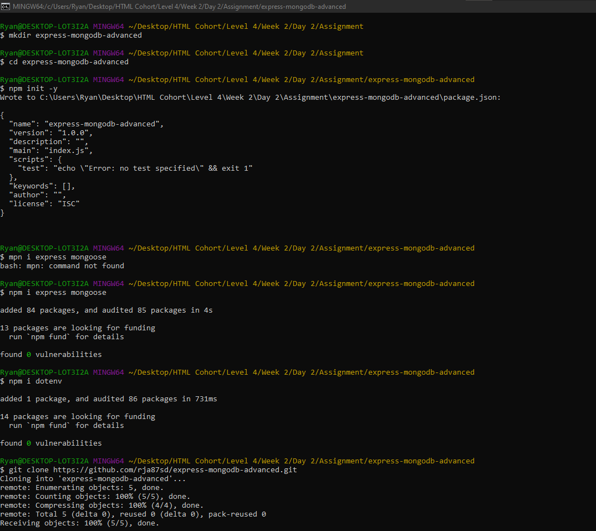

### Create the Server:

Create a file named index.js and set up a basic Express server with Mongoose connection.  
  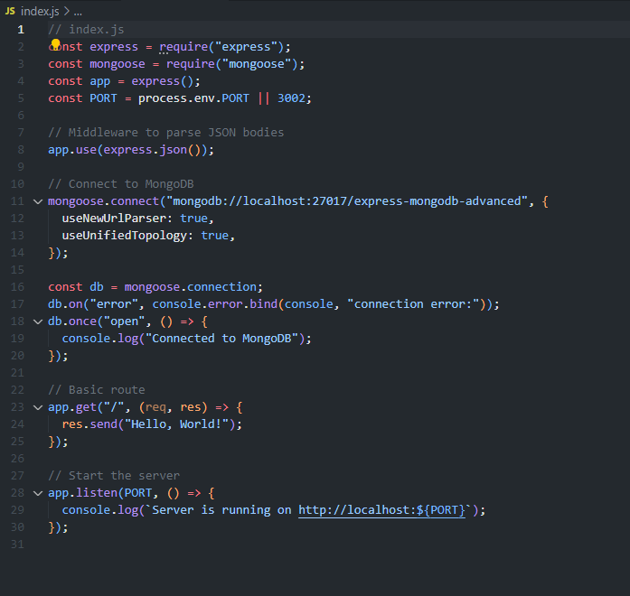  
  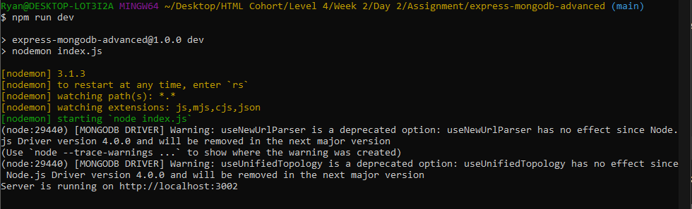

## Part 2: Define the Schema and Model
### Create models/User.js:

Define a user schema with the following fields: name, email, age, and isActive.  
  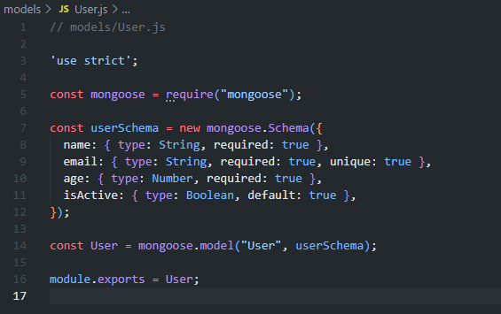

## Part 3: Create and Read Users
### Update index.js to include routes for creating and reading users:

Route to add a new user (POST /users).  
  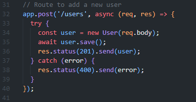

Route to get all users (GET /users).  
  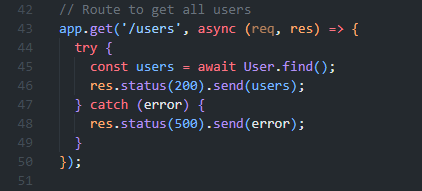

Route to get active users (GET /users/active).  
  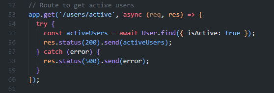

## Part 4: Test Create and Read Operations
### Start Your Server:

npm run dev  
  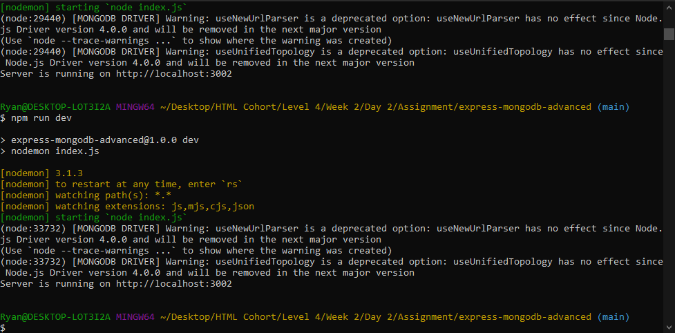

### Test with Thunder Client or Postman:

Create a User:

Method: POST
URL: http://localhost:3000/users
Body: JSON
{
  "name": "John Doe",
  "email": "john@example.com",
  "age": 25
}  
  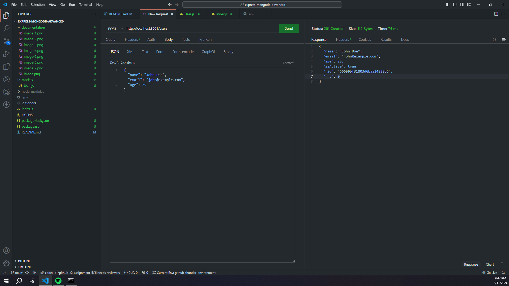

Get All Users:

Method: GET
URL: http://localhost:3000/users  
  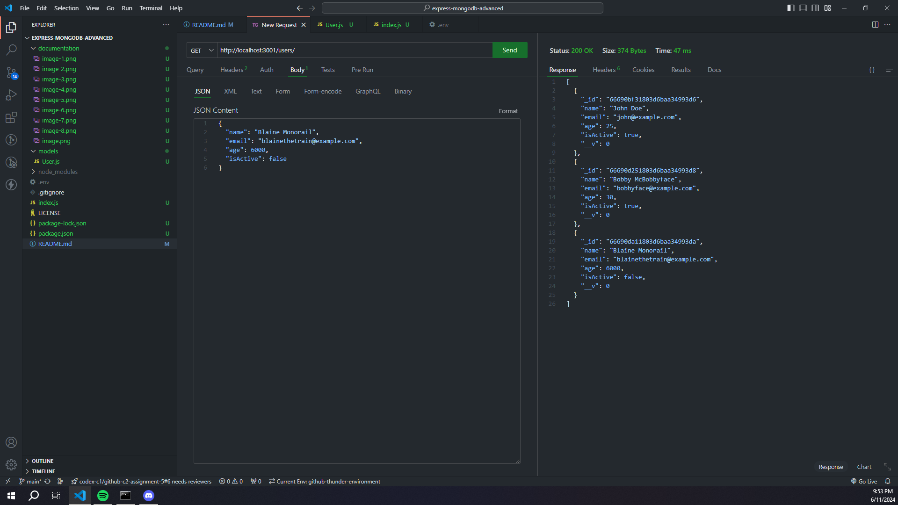

Get Active Users:

Method: GET
URL: http://localhost:3000/users/active  
  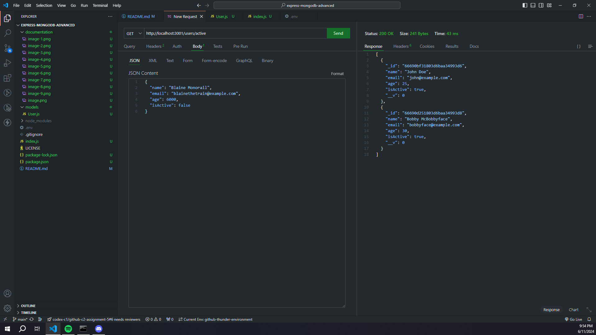

## Part 5: Update and Delete Users
### Update index.js to include update and delete routes:

Route to update a user (PUT /users/:id).  
  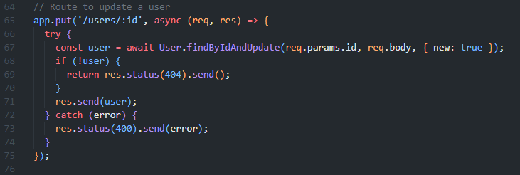

Route to deactivate a user (PUT /users/:id/deactivate).  
  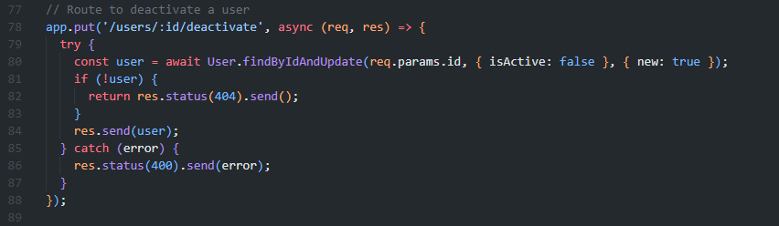

Route to delete a user (DELETE /users/:id).  
  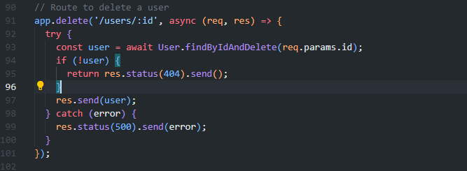

## Part 6: Test Update and Delete Operations
### Start Your Server:

npm run dev

### Test with Thunder Client or Postman:

Update a User:

Method: PUT
URL: http://localhost:3000/users/<user-id>
Body: JSON
{
  "name": "Jane Doe",
  "email": "jane@example.com",
  "age": 28
}  
  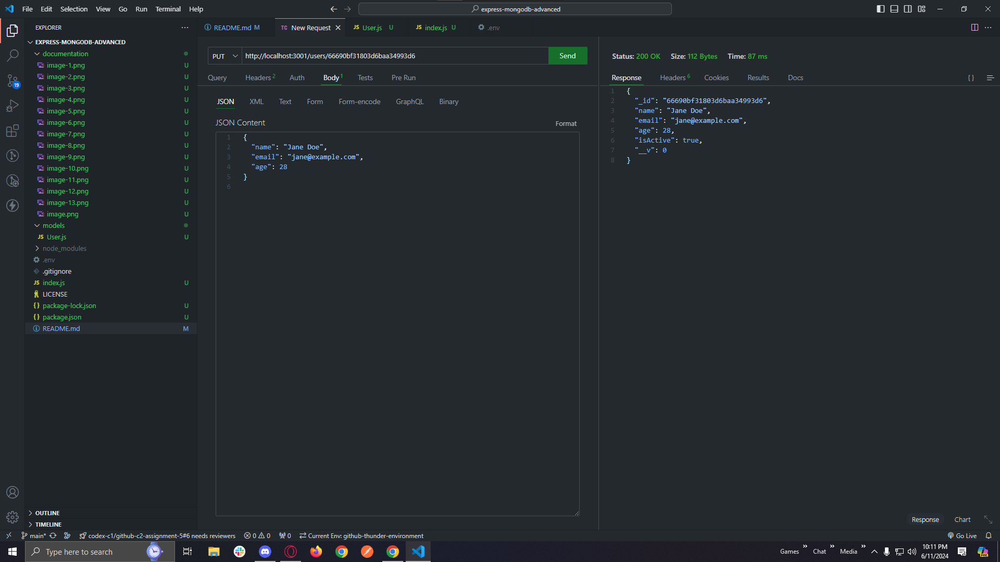

Deactivate a User:

Method: PUT
URL: http://localhost:3000/users/<user-id>/deactivate  
  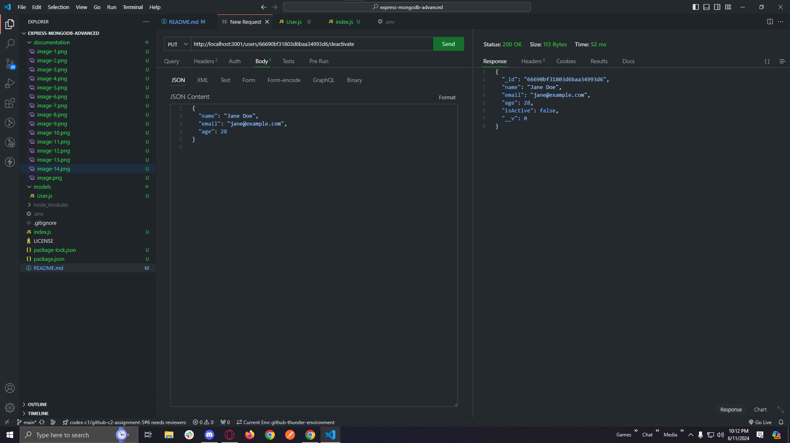

Delete a User:

Method: DELETE
URL: http://localhost:3000/users/<user-id>  
    
  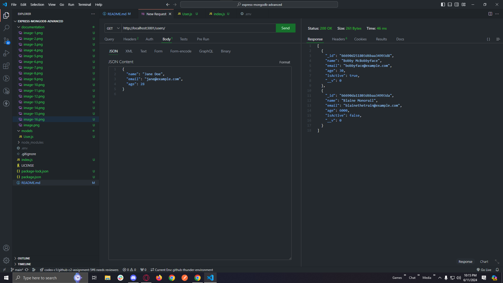

# Submission
GitHub Repository: Create a new repository named express-mongodb-advanced. Push your project to the repository and submit the URL. Ensure it includes all necessary files to run the server, including the README.md.
Screenshots: Include the screenshots of your POST, GET, PUT, and DELETE requests in the README.md.8